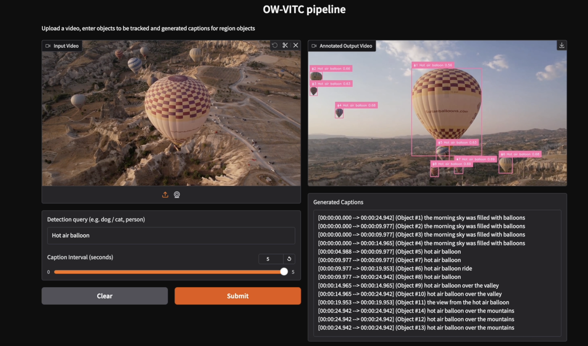

# Prompt-guided Video Object Tracking and Captioning App

Please read carefully about the requirements for packages and execution.
## Files included
* demo.png: a screenshot of the demo
* Pipeline.py: architecture of the application
* newPipeline.ipynb: notebook version of the application
* gradio_app.py: Gradio web application (recommended to use)
## Packages required
* opencv-python
* torch
* transformers
* supervision
* pillow
* numpy
* tqdm
* gradio
## Execution command
`python gradio_app.py`
